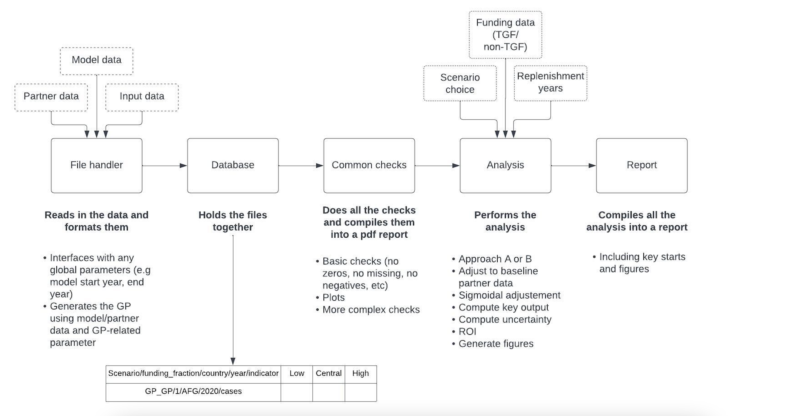
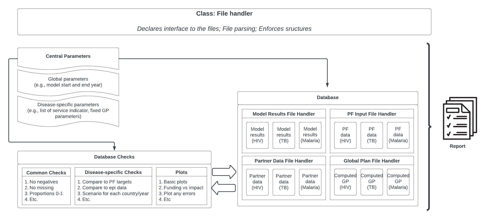
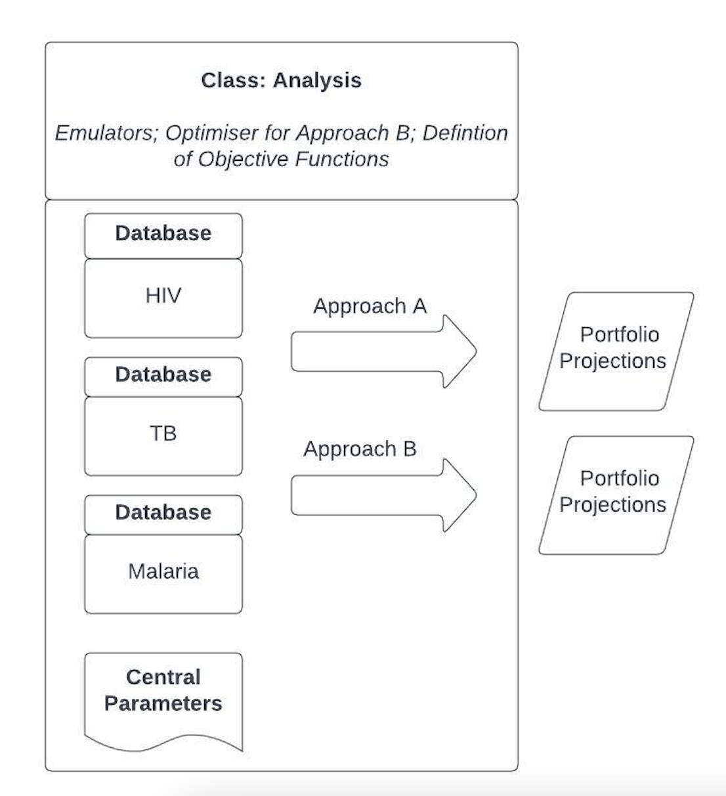
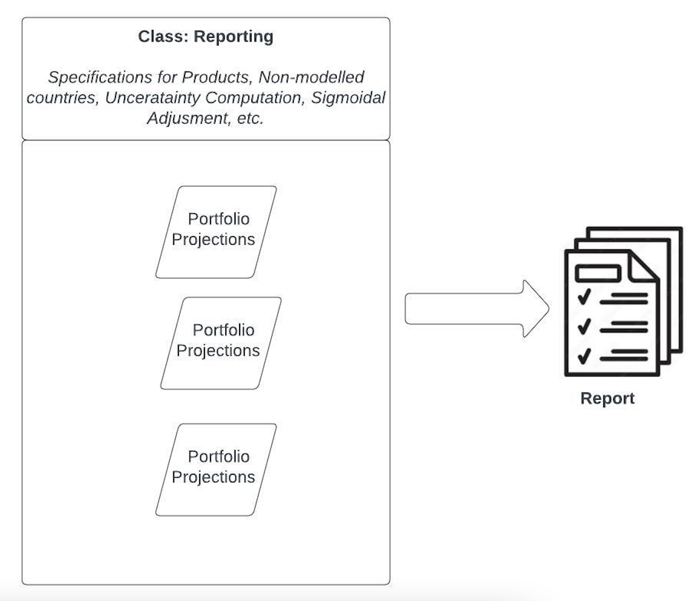
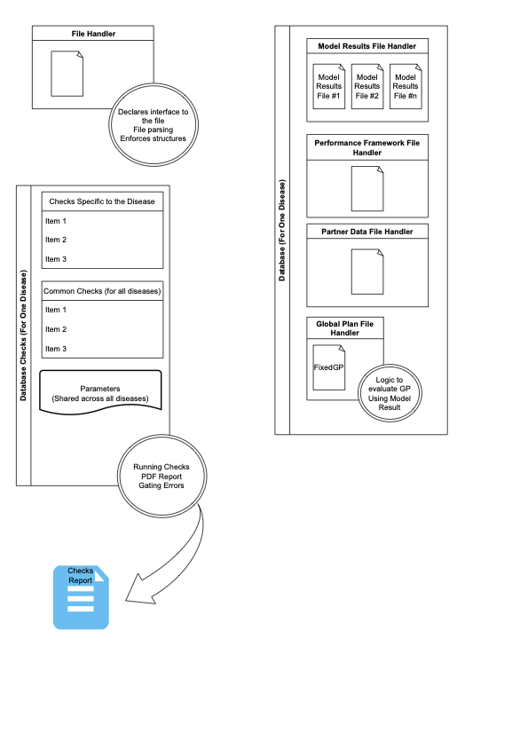
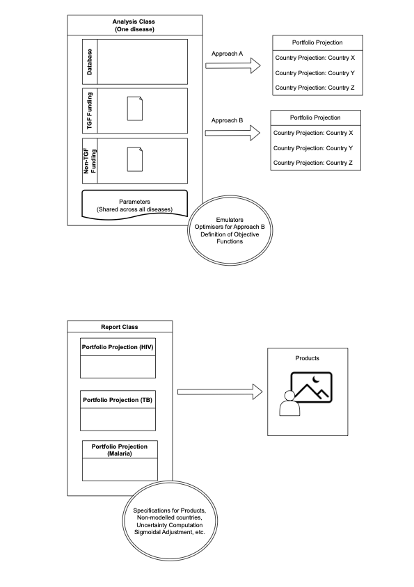

# Dummy's guide to tgftool framework

This page provides a detailed overview of the tgftool framework. 

The framework is designed to be a robust and agile framework with which to process model output for various Global Fund 
related projects, for example, the Investment Case and Strategy Target setting. 

Briefly, the framework contains three parts to the codebase in the folders outlined below: 
1) The scripts: These can be found in folder src/scripts under individual project folder(s). This code is project 
specific and is stored within the specific project folder. 
2) The tgftools: These can be found in folder src/tgftools. These are classes that are used throughout the code base. 
These files should not be modified. Their functionality are described in more details below.
3) The tests: These can be found in tests. These are a series of tests that should be executed periodically and they 
check the framework is functioning correctly. These files should not be modified. 

The below diagrams outlines the overall framework structure. The first step is reading in the necessary data, including 
the model data, the pf input data and the partner data. This functionality is handled by the FileHandler Class. All the 
data is formatted within the scripts (src/scripts) and collated into the Database Class which holds all this data. The 
data is formatted into a homogenous format, as outlined in the diagram, to be able to be processed by the rest of the 
framework. 

The Database containing all the relevant data sources is provided to the Check Class which performs various checks on 
the data and collates the findings from these checks into a report. It also provides the data to the Analysis Class. 
This class performs all necessary analysis, as outlined in the diagram below, including optimization, baseline
adjustment, etc. It also has the functionality to visualise the various choices of the analysis (GF funding amount, 
Approach A or B and inclusion/exclusion of non-GF amounts) for decision-making. It uses as an input the counry-specigic 
TGF and non-TGF funding data. 

Finally, the Report Class collates all the output from the final analysis into a report, including all necessary graphs. 

**Figure 1. Overview of framework**

**Figure 2. Overview of FileHandler, Database and Check Classes**

**Figure 3. Overview of the Analysis Class**

**Figure 4. Overview of the Rporting Class** 

Tim's original diagrams: 

